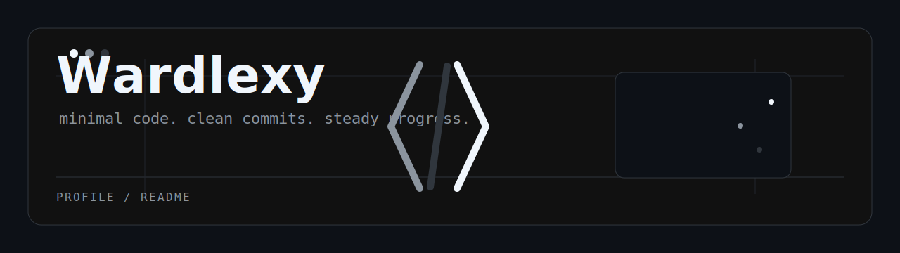
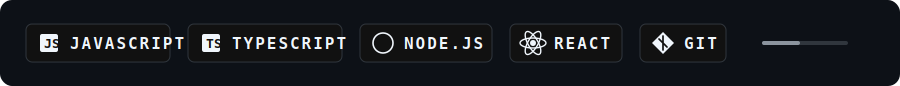
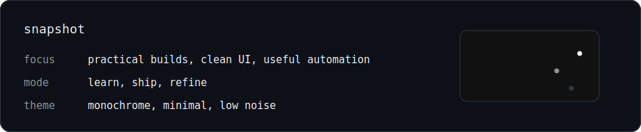

<p align="center">
  
</p>

<h1 align="center">Wardlexy</h1>

<p align="center">
  
</p>

<p align="center">
  <a href="https://github.com/Wardlexy?tab=repositories"></a>
</p>

---

### About

```txt
focus      practical software, clean interfaces, and useful automation
style      simple first, polished after
mindset    keep shipping, keep improving
theme      black / white / grey, quietly sharp
```

I like projects that feel useful, intentional, and not too noisy.  
Currently sharpening my work around code that is ez to read, ez to run, and ez to improve.

### Stack

<p align="center">
  
</p>

### Snapshot

<p align="center">
  
</p>

### Contributions

<p align="center">
  <picture>
    <source media="(prefers-color-scheme: dark)" srcset="https://raw.githubusercontent.com/Wardlexy/Wardlexy/output/github-contribution-grid-snake-dark.svg">
    <source media="(prefers-color-scheme: light)" srcset="https://raw.githubusercontent.com/Wardlexy/Wardlexy/output/github-contribution-grid-snake.svg">
    
  </picture>
</p>

